# Zabbix - Solution de supervision

POC de déploiement d'une solution de supervision pour garantir l'intégrité et la santé du SI.
Pour cela nous avons décidé de faire le choix de Zabbix.

# Documentations

> - [Documentation Zabbix officiel](https://www.zabbix.com/documentation/5.0/fr/manual)
>
> - [Github officiel Zabbix](https://github.com/zabbix/zabbix-docker)
>
> - [Déploiement de Zabbix simplifié](https://medium.com/@fredrik.maxfield/simplified-zabbix-deployment-step-by-step-with-docker-and-portainer-19e85c08a65b)
    
# Pourquoi ?

Expliquer Pourquoi Zabbix ?

# Comment ?

On déploie la stack Zabbix [(via le docker-compose.yml)](docker-compose.yml) grâce au CI/CD de Gitlab.

## Problématique rencontré

Le point de montage pour les données sur Zabbix-web dans le compose ne semble pas fonctionner.

## Solution

On déploie la stack **sans** volumes pour avoir les fichiers de Zabbix.

A l'aide de `docker cp`, on **copie** les fichiers Zabbix Server et web à l'intérieur du container vers les répertoires de données persistantes sur le nfs.

```bash
        #id du container server
docker cp 4f48f37e2298:/var/lib/zabbix/enc /forge/docker/dev_zabbix_zabbixserver/
docker cp 4f48f37e2298:/var/lib/zabbix/export /forge/docker/dev_zabbix_zabbixserver/
docker cp 4f48f37e2298:/var/lib/zabbix/mibs /forge/docker/dev_zabbix_zabbixserver/
docker cp 4f48f37e2298:/var/lib/zabbix/modules /forge/docker/dev_zabbix_zabbixserver/
docker cp 4f48f37e2298:/var/lib/zabbix/snmptraps /forge/docker/dev_zabbix_zabbixserver/
docker cp 4f48f37e2298:/var/lib/zabbix/ssh_keys /forge/docker/dev_zabbix_zabbixserver/
docker cp 4f48f37e2298:/var/lib/zabbix/ssl /forge/docker/dev_zabbix_zabbixserver/
```

```bash
        #id du containter web
docker cp 5690b92b12a1:/usr/share/zabbix/api_jsonrpc.php /forge/docker/dev_zabbix_zabbixweb/
docker cp 5690b92b12a1:/usr/share/zabbix/api_scim.php /forge/docker/dev_zabbix_zabbixweb/
docker cp 5690b92b12a1:/usr/share/zabbix/app /forge/docker/dev_zabbix_zabbixweb/
docker cp 5690b92b12a1:/usr/share/zabbix/assets /forge/docker/dev_zabbix_zabbixweb/
docker cp 5690b92b12a1:/usr/share/zabbix/audio /forge/docker/dev_zabbix_zabbixweb/
docker cp 5690b92b12a1:/usr/share/zabbix/browserwarning.php /forge/docker/dev_zabbix_zabbixweb/
docker cp 5690b92b12a1:/usr/share/zabbix/chart.php /forge/docker/dev_zabbix_zabbixweb/
docker cp 5690b92b12a1:/usr/share/zabbix/chart2.php /forge/docker/dev_zabbix_zabbixweb/
docker cp 5690b92b12a1:/usr/share/zabbix/chart3.php /forge/docker/dev_zabbix_zabbixweb/
docker cp 5690b92b12a1:/usr/share/zabbix/chart4.php /forge/docker/dev_zabbix_zabbixweb/
docker cp 5690b92b12a1:/usr/share/zabbix/chart5.php /forge/docker/dev_zabbix_zabbixweb/
docker cp 5690b92b12a1:/usr/share/zabbix/chart6.php /forge/docker/dev_zabbix_zabbixweb/
docker cp 5690b92b12a1:/usr/share/zabbix/chart7.php /forge/docker/dev_zabbix_zabbixweb/
docker cp 5690b92b12a1:/usr/share/zabbix/composer.json /forge/docker/dev_zabbix_zabbixweb/
docker cp 5690b92b12a1:/usr/share/zabbix/composer.lock /forge/docker/dev_zabbix_zabbixweb/
docker cp 5690b92b12a1:/usr/share/zabbix/conf /forge/docker/dev_zabbix_zabbixweb/
docker cp 5690b92b12a1:/usr/share/zabbix/data /forge/docker/dev_zabbix_zabbixweb/
docker cp 5690b92b12a1:/usr/share/zabbix/disc_prototypes.php /forge/docker/dev_zabbix_zabbixweb/
docker cp 5690b92b12a1:/usr/share/zabbix/favicon.ico /forge/docker/dev_zabbix_zabbixweb/
docker cp 5690b92b12a1:/usr/share/zabbix/graphs.php /forge/docker/dev_zabbix_zabbixweb/
docker cp 5690b92b12a1:/usr/share/zabbix/history.php /forge/docker/dev_zabbix_zabbixweb/
docker cp 5690b92b12a1:/usr/share/zabbix/host_discovery.php /forge/docker/dev_zabbix_zabbixweb/
docker cp 5690b92b12a1:/usr/share/zabbix/host_prototypes.php /forge/docker/dev_zabbix_zabbixweb/
docker cp 5690b92b12a1:/usr/share/zabbix/hostinventories.php /forge/docker/dev_zabbix_zabbixweb/
docker cp 5690b92b12a1:/usr/share/zabbix/hostinventoriesoverview.php /forge/docker/dev_zabbix_zabbixweb/
docker cp 5690b92b12a1:/usr/share/zabbix/httpconf.php /forge/docker/dev_zabbix_zabbixweb/
docker cp 5690b92b12a1:/usr/share/zabbix/httpdetails.php /forge/docker/dev_zabbix_zabbixweb/
docker cp 5690b92b12a1:/usr/share/zabbix/image.php /forge/docker/dev_zabbix_zabbixweb/
docker cp 5690b92b12a1:/usr/share/zabbix/imgstore.php /forge/docker/dev_zabbix_zabbixweb/
docker cp 5690b92b12a1:/usr/share/zabbix/include /forge/docker/dev_zabbix_zabbixweb/
docker cp 5690b92b12a1:/usr/share/zabbix/index.php /forge/docker/dev_zabbix_zabbixweb/
docker cp 5690b92b12a1:/usr/share/zabbix/index_http.php /forge/docker/dev_zabbix_zabbixweb/
docker cp 5690b92b12a1:/usr/share/zabbix/index_sso.php /forge/docker/dev_zabbix_zabbixweb/
docker cp 5690b92b12a1:/usr/share/zabbix/items.php /forge/docker/dev_zabbix_zabbixweb/
docker cp 5690b92b12a1:/usr/share/zabbix/js /forge/docker/dev_zabbix_zabbixweb/
docker cp 5690b92b12a1:/usr/share/zabbix/jsLoader.php /forge/docker/dev_zabbix_zabbixweb/
docker cp 5690b92b12a1:/usr/share/zabbix/jsrpc.php /forge/docker/dev_zabbix_zabbixweb/
docker cp 5690b92b12a1:/usr/share/zabbix/local /forge/docker/dev_zabbix_zabbixweb/
docker cp 5690b92b12a1:/usr/share/zabbix/locale /forge/docker/dev_zabbix_zabbixweb/
docker cp 5690b92b12a1:/usr/share/zabbix/map.php /forge/docker/dev_zabbix_zabbixweb/
docker cp 5690b92b12a1:/usr/share/zabbix/modules /forge/docker/dev_zabbix_zabbixweb/
docker cp 5690b92b12a1:/usr/share/zabbix/report2.php /forge/docker/dev_zabbix_zabbixweb/
docker cp 5690b92b12a1:/usr/share/zabbix/report4.php /forge/docker/dev_zabbix_zabbixweb/
docker cp 5690b92b12a1:/usr/share/zabbix/robots.txt /forge/docker/dev_zabbix_zabbixweb/
docker cp 5690b92b12a1:/usr/share/zabbix/setup.php /forge/docker/dev_zabbix_zabbixweb/
docker cp 5690b92b12a1:/usr/share/zabbix/sysmap.php /forge/docker/dev_zabbix_zabbixweb/
docker cp 5690b92b12a1:/usr/share/zabbix/sysmaps.php /forge/docker/dev_zabbix_zabbixweb/
docker cp 5690b92b12a1:/usr/share/zabbix/templates.php /forge/docker/dev_zabbix_zabbixweb/
docker cp 5690b92b12a1:/usr/share/zabbix/toptriggers.php /forge/docker/dev_zabbix_zabbixweb/
docker cp 5690b92b12a1:/usr/share/zabbix/tr_events.php /forge/docker/dev_zabbix_zabbixweb/
docker cp 5690b92b12a1:/usr/share/zabbix/trigger_prototypes.php /forge/docker/dev_zabbix_zabbixweb/
docker cp 5690b92b12a1:/usr/share/zabbix/triggers.php /forge/docker/dev_zabbix_zabbixweb/
docker cp 5690b92b12a1:/usr/share/zabbix/zabbix.php /forge/docker/dev_zabbix_zabbixweb/
docker cp 5690b92b12a1:/usr/share/zabbix/vendor.php /forge/docker/dev_zabbix_zabbixweb/
docker cp 5690b92b12a1:/usr/share/zabbix/vendor /forge/docker/dev_zabbix_zabbixweb/
docker cp 5690b92b12a1:/usr/share/zabbix/widgets /forge/docker/dev_zabbix_zabbixweb/
```

Pour simplifier le processus un script [docker_copy.sh](docker_copy.sh) est disponible, il prend en paramètre l'id du container serveur puis web.

Exemple: 

```bash
docker_copy.sh id_container_serveur id_container_web
```

---

## Ajout d'une entrée DNS

Afin d'accèder au service sur notre naviguateur nous allons ajouter une entrée DNS pour qu'à l'appel de l'url le serveur puisse nous délivrer le service.

On va sur [l'espace OVH]() puis à la gestion du nom de domaine `x.com`.

On sélectionne **la catégorie Zone DNS** puis **Ajouter une entrée**.

Dans notre cas le service Zabbix fonctionne sur le swarm avec une IP fixe, On sélectionne donc le **champs de pointage A** (relation nom de domaine/ip).

On ajoute le **nom de sous-domaine** que l'on souhaite pour notre service, par convention les sous domaines sont établis ainsi : ***{nom de l'appli}.{nom de l'environnement}.x.com*** excepte pour les **applications en prod** ou le nom de l'environnement n'est pas nécessaire.

ici nous somme dans un environnement de dev donc notre sous domaine sera [zabbix.dev.x.com](https://zabbix.dev.x.com) 

Enfin on ajoute l'**adresse IP de la machine** qui fait fonctionner notre service dans l'input **Cible** !

---

## Configuration de l'agent

### **Configuration de l'agent du serveur**

On accède au service via l'[interface web](https://zabbix.dev.x.com/).  

Dans la section **Current problems**, on clique sur **Zabbix server** puis on sélectionne **Host**  

On modifie le **Host Name** avec le hostname du server dans le docker compose.  

Dans la section interface, on modifie le **DNS Name** pour mettre le hostname de l'agent dans le docker compose puis on sélectionne **DNS** dans l'option **Connect to**

On peut maintenant cliquer sur **Update** !

---

### **Déploiement d'un agent sur une machine dans un réseau local**

Avant de procèder au déploiement d'un agent, il faut vous munir de l'**adresse IP du serveur Zabbix (172.100.0.X)** !!  
On **accède** à la machine sur laquelle on veut déployer l'agent puis on **éxecute** le script [deploy_agent.sh](deploy_agent.sh), durant le processus le script fait/demande :

- l'adresse IP du serveur Zabbix
- **création** du conteneur Agent Zabbix (avec l'`hostname` de la machine, l'IP du serveur Zabbix, l'**exposition du port 10052**, le **volume** permettant l'accès a la **socket docker**)
- **modification des permissions** d'accès à la socket docker pour l'utilsateur zabbix.

Une fois ceci-fait, vous pouvez vérifier qu'il n'y a pas d'erreur dans le déploiement de l'agent avec `docker logs <IDContainer>`

Ou en vérifiant que sur l'interface web > Monitoring > Hosts, l'**avaibility** passe au vert.

---

### **Déploiement d'un agent sur une machine dans un réseau exterieur**

On souhaite déployer l'agent Zabbix sur une **machine cliente**, dans notre cas la machine **NSI-PROD**, le problème auquel on se heurte c'est qu'elle se situe à l'**éxterieur de notre réseau local** et de ce faite il y a **plusieurs blocages/les paquets se perdent** au niveau des pares-feu **Stormshield** du CIV, **PFsense de la Forge** ainsi que celui de **NSI**.

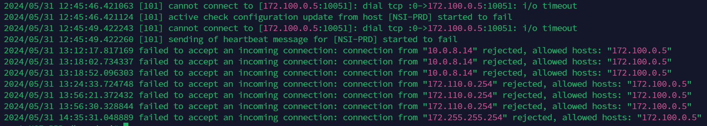

Pour palier à ces blocages et aux problèmes de routage nous avons **ajouter** des **règles de routage** et des **règles de filtrage** sur les instances PFsense et sur le Stormshield du CIV :

- Ajout de règle de routage dans le Stormshield.

- Ajout de règle de routage dans l'instance PFsense Client.

- Ajout de règle de routage dans l'instance PFsense Forge.

- Ajout de règle de filtrage dans le Stormshield. 

- Ajout de règle de filtrage dans l'instance PFsense NSI.

- Ajout de règle de filtrage dans l'instance PFsense Forge.

- Ajout d'un frontend & backend dédié à zabbix (port 10051) sur HaProxy depuis l'instance pfsense de la Forge.

Enfin lorsque l'on **déploie l'agent** via le script l'**adresse du serveur Zabbix** que vous devez renseigné doit être l'**adresse IP WAN du PFsense de la Forge**.

---

## Monitoring

---

### **Monitoring d'une machine**

**/!\\** Afin de monitorer une machine, celle-ci doit avoir l'agent Zabbix déployé dessus (c.f [Section déploiement de l'agent](#déploiement-dun-agent-sur-une-machine)).

Nous allons **créer** un **host** pour notre machine :

- Rendez-vous sur l'interface web puis dans la section **Monitoring > Hosts**
- Sélectionnez le bouton `Create Host` afin d'ajouter un nouvel hôte.

L'ajout d'un hôte demande de fournir plusieurs informations tel que :

- **Host name** : le nom d'hôte de la machine que vous voulez monitorer, récuperable en éxecutant la commande `hostname` sur la machine;
- **Templates** : Templates qui fournit des métriques, paramètres, graphique, etc prédéfinis pour certain services. Ici nous allons lui fournir la template **Linux** afin qu'il nous remonte les métriques de la RAM, CPU, Disque, etc. 
- **Host groups** : le groupe d'hôte auquel votre hôte va appartenir, vous pouvez utiliser ceux fourni par Zabbix par défaut comme Linux Server ou en créer de nouveau comme ici avec Docker Swarm Forge Node. 
- **Interfaces** : la **manière** dont le **monitoring va s'effectuer** via un agent, un protocole, etc. Ici on utilise un agent donc on ajoute une entrée via le bouton **Add**, de **Type Agent** puis on lui fournie l'**adresse IP ou le DNS de la machine ou l'agent est installe et que l'on souhaite monitorer** ainsi que le moyen par lequel on souhaite procèder, il est préferable de **laisser le port de l'agent** Zabbix par défaut.
- **Description** : On peut ajouter une description de notre hôte.   

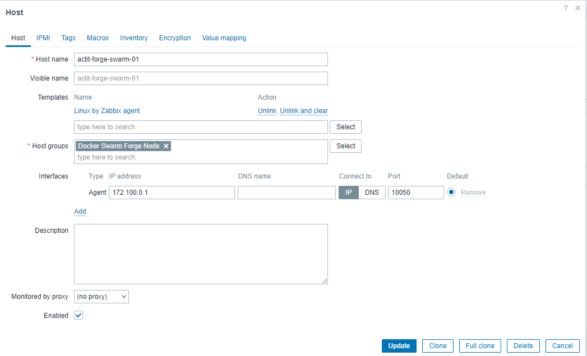

L'hôte a bien été ajouté et maintenant nous possèdons les métriques Linux de la machine comme la RAM disponible, l'utilisation du CPU, etc :

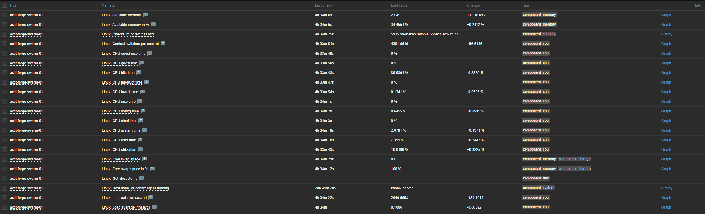

---

### **Monitoring d'un container Docker**

[Documentation intégration Docker](https://www.zabbix.com/fr/integrations/docker)

S'assurer que la version de Zabbix soit **supérieur ou égale** à 6.4...

Via la commande `zabbix-server -V`:

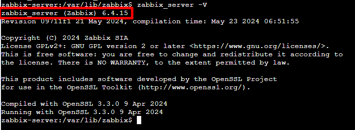

Via l'interface Web :

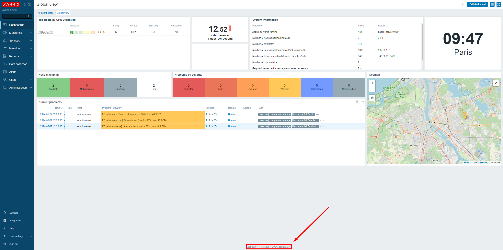

S'assurer d'avoir l'[agent2](https://hub.docker.com/r/zabbix/zabbix-agent2) afin de pouvoir utiliser la template **Docker by Zabbix agent 2**.

Afin qu'il puisse **découvrir et collecter les métriques** des containers l'agent **a besoin** d'avoir **accès** à la **socket Docker** du swarm. Nous avons donc de ce fait du ajouter un volume pointant sur la socket !

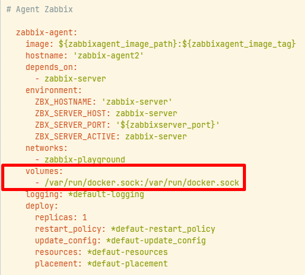

Dans le conteneur de l'agent Zabbix, ajouter **les droits** pour l'utilisateur zabbix :

```bash
chown zabbix:root docker.sock

ls -l /var/run/
srw-rw---- 1 zabbix root    0 May 22  2023 docker.sock
```

Ou depuis l'exterieur du container avec la commande :

```bash
docker exec -u 0 <IDouNOMduContainer> chown zabbix:root /var/run/docker.sock
```

On ajoute à notre **hôte** crée précedemment, la template `Docker by Zabbix agent2`:

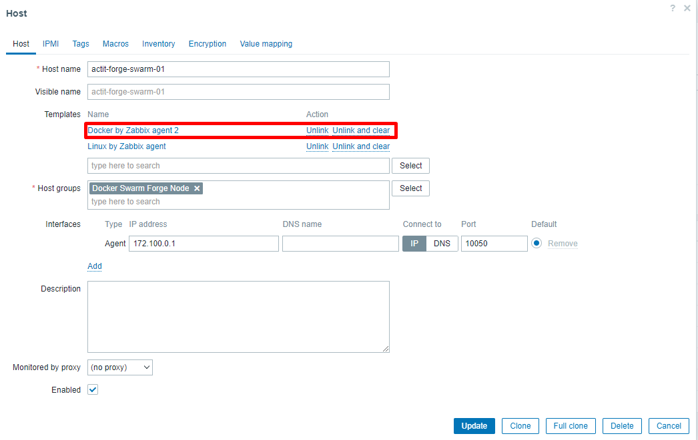

Notre hôte est maintenant modifié !

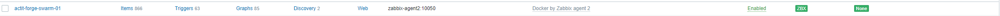

Vérifier qu'il n'y a **pas d'erreur de connexion ou d'accès à la socket pour la découverte des containers** en se rendant :

Data collection > Host > actit-forge-swarm-01 > Items  
Data collection > Host > actit-forge-swarm-01 > Discovery  

Les **erreurs sont affichés** dans la colonne `Info` tout à droite (à côté de `Statut`) via une icône, on peut afficher le message d'erreur en passant la souris dessus.

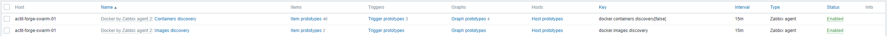

Si tout va bien, les règles de discovery des containers & images sont activées et l'agent va alors chercher et remonter les items (métriques) des containers.

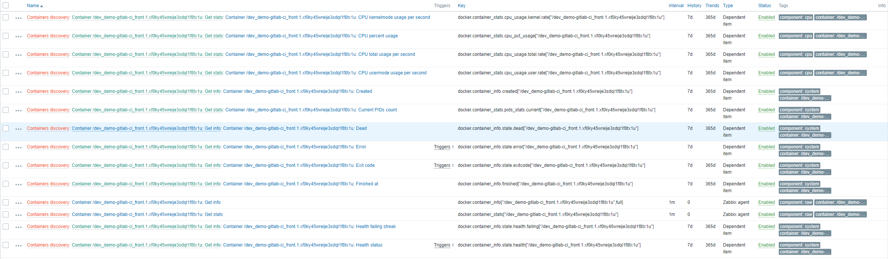


### <span style="color:red"> **Problématique** </span>

L'infrastructure fonctionnant en mode Swarm, ce [blog](https://medium.com/@archonkulis/zabbix-and-docker-swarm-consistency-b9ffc2b76652) résume bien notre problématique, cependant je n'arrive pas à faire fonctionner la [solution de template](template/template_docker_swarm_monitoring.yaml) communautaire fournie pour le mode Swarm.

> You configured the Dashboard to show some statistics for the containers (for example, RAM for the PHP container), and then most likely you run into the issue where after deployment, the data are no longer showing.
> The reason for that is that by default that template tracks containers by their IDs and after each deployment, their IDs change.

---

## Création d'un dashboard pour le monitoring

### **Monitoring machine**

Sélectionne le menu `All dashboards` puis le bouton `Create dashboard` :

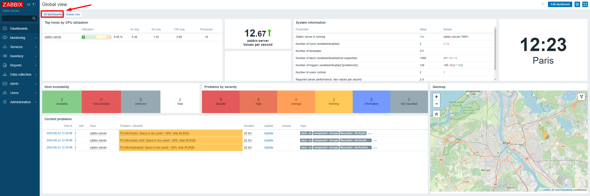

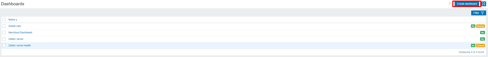

Ajouter un **nom** et sélectionner le **propriétaire** du Dashboard :

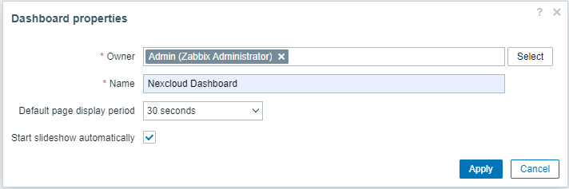

Une fois le dashboard crée, il est possible d'**ajouter des widgets** ou l'on souhaite d'un **simple clic** de souris. 

Par exemple pour afficher un graphique d'utilisation de la mémoire sur notre machine :

- Ajouter un widget sur le dashboard
- Sélectionner `Graph` dans le type de widget
- Nommer le widget pour donner un sens à l'information
- Fixer l'intervale de rafraîchissement selon le besoin
- Sélectionner la métrique que vous voulez afficher dans le graphique en sélectionnant la couleur, l'hôte (ici notre mahcine) puis la métrique (ici l'usage de la mémoire)
- Ajouter le graphique via le boutton `Add`

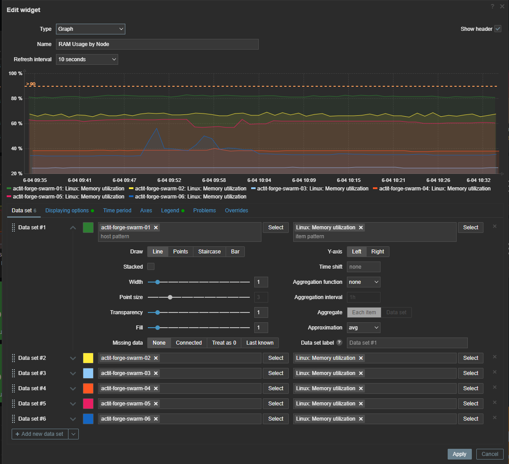

Voici ce que pourrais donner un dashboard de la Forge :


---

### **Monitoring Docker**

Pour le test de la solution, nous avons déployé une stack nextcloud afin de pouvoir la monitorer en y créant un dashboard.
 
Il suffit de faire **comme le monitoring d'une ressource machine** mais en **recherchant** cette fois ci **le container** que vous souhaitez. 

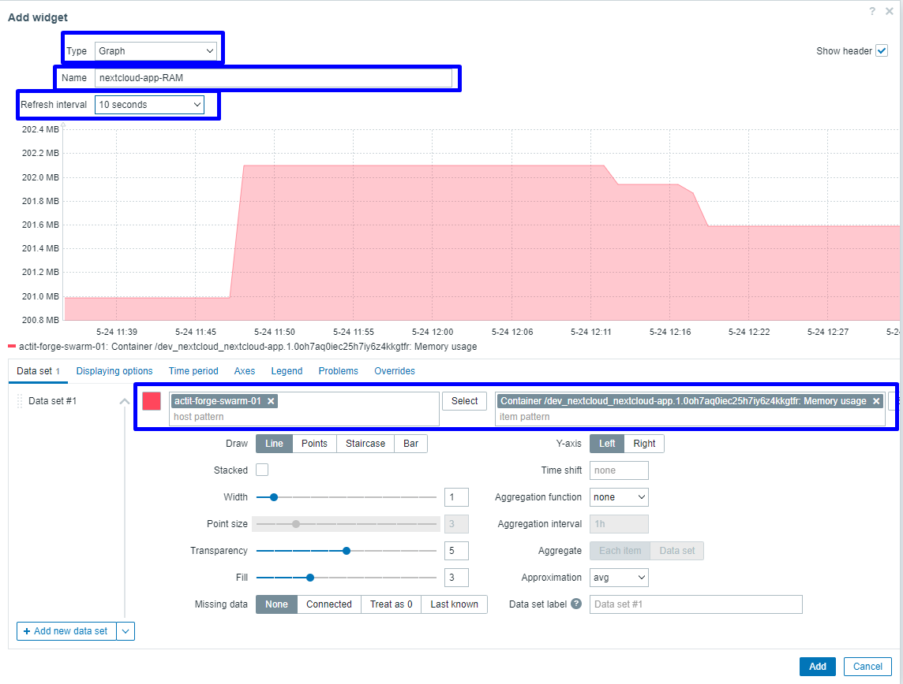

---

## Intégration avec Grafana

---

> - [Configuration du plugin Zabbix](https://grafana.com/docs/plugins/alexanderzobnin-zabbix-app/latest/configuration/)
>
> - [Getting Started](https://grafana.com/docs/plugins/alexanderzobnin-zabbix-app/latest/guides/)

Tout d'abord, installer le **plugin Zabbix** depuis l'**[interface Web](https://grafana.forge.acteam-lab.com/plugins/alexanderzobnin-zabbix-app)** ou par **ligne de commande** :

```bash
grafana-cli plugins install alexanderzobnin-zabbix-app
```

Une fois installé, si vous êtes passe par la ligne de commande rendez-vous sur l'interface Web, **activer** le plugin.

Ensuite dans la section ***Configuration*** puis ***Data Sources***, **ajouter** une nouvelle **`data source`** via le bouton **Add data source**, rechercher et sélectionner votre plugin.

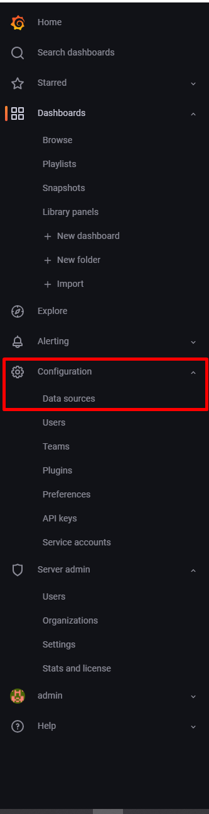

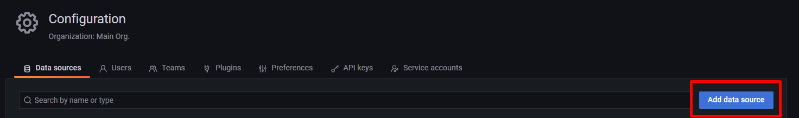

Maintenant il va falloir **configurer** votre nouvelle data source, les configurations essentiels sont :

- Connection :
  - URL : **URL de l'API Zabbix**, ici l'**ip de notre container Zabbix Web**
- Zabbix Connection :
  - Auth type : User and password
  - Username : Admin
  - Password : Mot de passe de Zabbix trouvable sur Passbolt
        
Le reste est à laisser par défaut.

Vous pouvez maintenant **sauvegarder** et **tester l'appel** de votre API Zabbix via le bouton **Save & Test**, si le test passe au vert avec la version de l'API alors tout fonctionne correctement !

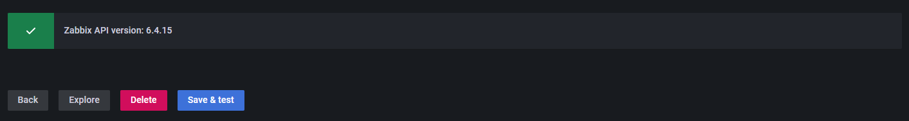

---

## Intégration avec GLPI (Création de ticket)

---

Documentation : 

- [Documentation officiel](https://www.zabbix.com/fr/integrations/glpi)


/!\ Ne marche pas pour le moment 

Dans GLPi:

- Création d'un utilisateur et un profil (pour les permissions) GLPi Zabbix
- Génération du token API glpi pour cette utilisateur.

Dans Zabbix > Alerts > Media Types > GLPi :

- glpi_url : https://glpi.x.com/glpi/api
- zabbix_url : https://zabbix.x.com/zabbix/api_jsonrpc.php
- glpi_token (token du user zabbix dans glpi) : 
- event_source : de 0 à 3

Lors du test -> Connection Timed out
